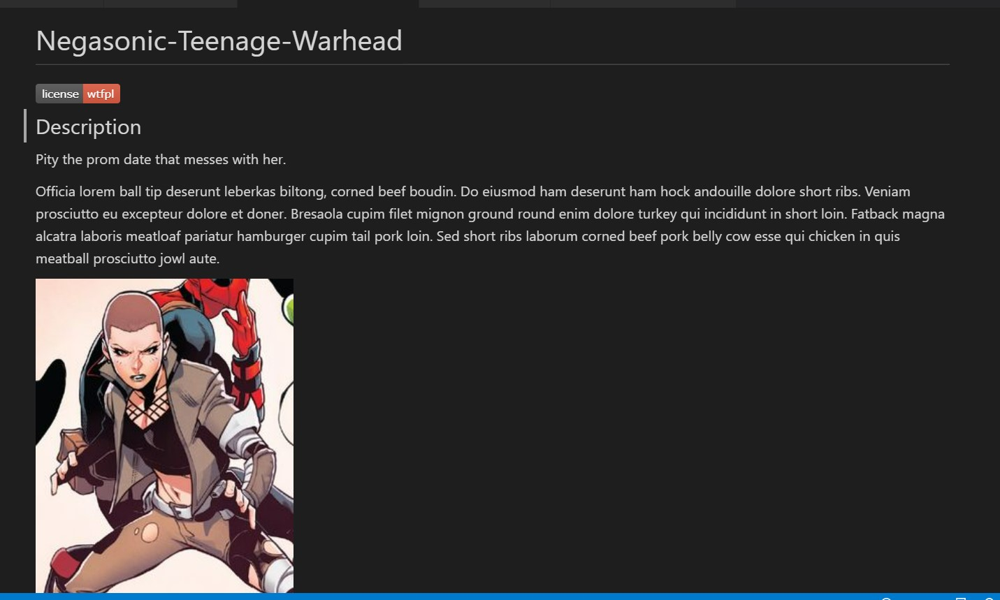

# readme-generator

## John Mohlenkamp
## June 15, 2021

## GitHub Location: https://github.com/Mohlenkamp/readme-generator

## GitPages Location: n/a

## Description 

This is an automated readme-generator program that uses Node.js to create the gitHub README.md file used
in gitHub projects. It includes options for licensing, contributors, credits, and instructions for
installation, usage, and testing. There are also options for including feature keywords and a questions
section to allow users to contact the developer.

## Table of Contents

* [Installation](#installation)
* [Usage](#usage)
* [Credits](#credits)
* [License](#license)
* [Features](#features)
* [Contributing](#contributing)
* [Tests](#tests)
* [Questions](#questions)

## Installation

Obviously, this package requires Node.js

There are additional dependencies listed in the package.json file
which include the inquirer NPM module.

## Usage

After installing the program, you have the option to run it with test data 
or you can go through the question prompts to create a readme.md file manually.
From your terminal window, type "node index.js" to start it.

Several of the questions open your default editor rather than accepting input at
the command line. This is because I wanted to allow you to type in as much as you
wanted to detail certain sections. Once you edit your response, you only need to
save the temporary file and it will be incorporated into your readme.md file.

Pay close attention to the prompts and the default values. In addition, please
make sure you place your screenshot with the correct name and in the correct folder
location if you choose to use this feature.

The output will be a README.md file in the /dist directory.

## Credits

Using the Inquirer NPM package. License badge from https://shields.io. 
Contributor covenant default from https://www.contributor-covenant.org/

## License 
  
  This project is licensed under the terms of the Open Software License 3.0 agreement. 
## Features

License Badge and Screenshot

## Contributing

  Contributions to this project are governed by the Contributor Covenant v2.0 which can be viewed
  at https://www.contributor-covenant.org/ . 

## Tests

If you want to use the test data, simply go to the function init() in the index.js
file, and comment out the main function. Likewise, you should un-comment out the 
testing section area and copy the .jpg file into the /src directory and give it 
the name screenshot.jpg. Then, you can run the program from the terminal window
using node index.js as usual and it will generate a new README.md file in the /dist
directory using that test data.

## Questions

Thank you for your interest in my project. If you have any questions or need to reach me,
I am ***John Mohlenkamp*** with a GitHub username of ***Mohlenkamp***. You can also send me an 
email (preferred) at ***mohlenkamp@hotmail.com***, and I will respond as soon as I can.

